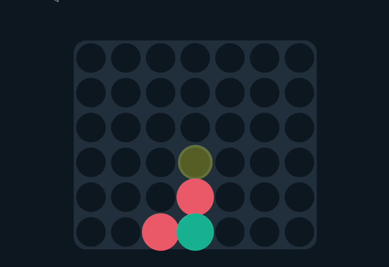
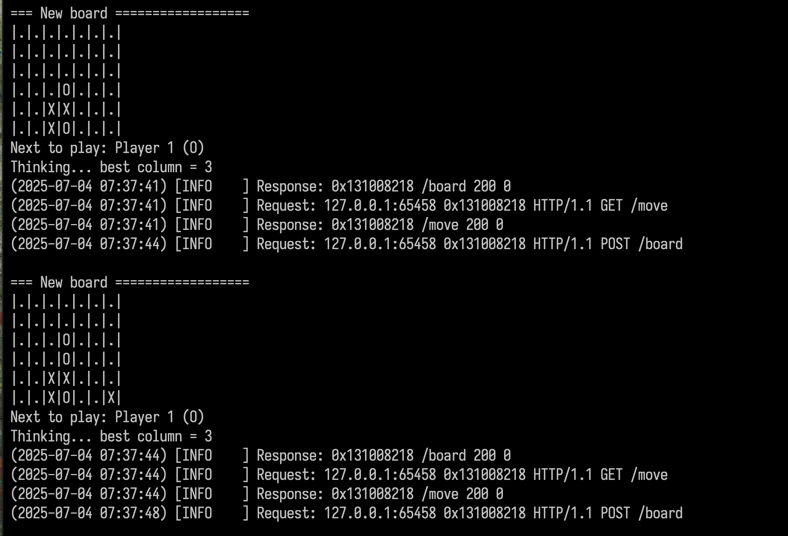

# ConnectKing

ConnectKing provides a simple C++ backend and a Tampermonkey userscript that allows you to play Connect-4 with an AI assistant. The script forwards the board state from [papergames.io](https://papergames.io/) to the local server which replies with the best move.



It works by implementing a lightweight MiniMax AI algorithm in C++, and it exposes endpoints to call the API with a 8x8 board array object using 'X' '0' and '' to mark spots, it will then return the best move. This is then used with a simple userscript plugged into a connect4 website of your choice (I provide one for papergames.io) and it will communicate with the locally hosted server to send board states on moves and return the best move indicated visually on the board. 

Note* I do not condone cheating in online games, this project was made mainly for learning about Web Servers, RPC protocols, simple AI algorithms and to mess around with friends.


## Structure

```
client/             # Browser extension and launchers
  inject/           # Tampermonkey script & manifest
  launch/           # Chrome/Chromium launch scripts
server/             # C++ backend
  src/              # C++ sources (main.cpp, crow_all.h)
  makefile          # Optional Makefile
  CMakeLists.txt    # CMake build file
```

## Requirements

- C++17 compiler (g++ or clang)
- CMake and Make
- OpenSSL development libraries

## Quick Start

```bash
./setup.sh       # fetch submodules and build the server
server/build/connect4 &
```

Then install the userscript and open the game:

1. Install the [Tampermonkey extension](https://www.tampermonkey.net/).
2. Load [`client/inject/tampermonkey.user.js`](client/inject/tampermonkey.user.js) in Tampermonkey.
3. Run `client/launch/launch_connect4.sh` (or the `.ps1` on Windows) to open the site with the extension loaded.

Note* You must run a chrome instance that has HTTPS security turned off as it will not allow the Userscript to send packets to the server otherwise, I've provided some scripts to allow you to do that from Linux/Windows in client/launch/

The script highlights the AI-suggested move on every turn.




